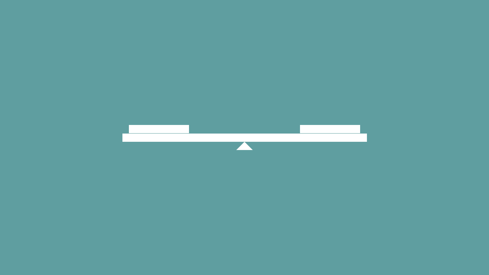
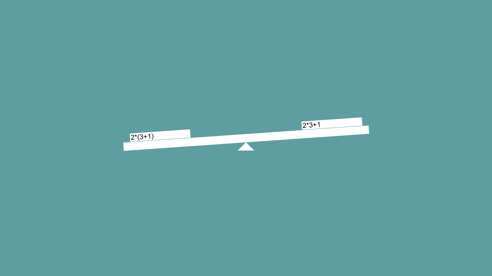

<h1 align="center" style="font-weight: bold;">Balança de Pratos ⚖️</h1>

 <a href="#tecnologias">Tecnologias</a> • 
 <a href="#started">Como testar</a>

    <b>Um projeto escolar que demonstra de maneira didática o conceito de equivalência em uma equação matemática.</b>

     <a href="https://adler-pereira.github.io/balanca-de-pratos/" target="_blank">📱 Visite esse projeto 💻</a>

<h2 id="layout">🎨 Layout</h2>

    
    

<h2 id="tecnologias">💻 Tecnologias</h2>

<h2 id="started">🚀 Como testar</h2>

A <b>Balança de Pratos</b> na matemática é um conceito que consiste em encontrar a equivalência entre dois lados de uma equação.

Ao acessar o link, você encontrará uma interface simples com dois campos de entrada: um para o lado esquerdo e outro para o lado direito.

Você pode inserir equações matemáticas, como por exemplo <b>2 + 2</b> de um lado e <b>4</b> do outro, e a balança irá indicar se a equação está balanceada ou não. Caso um lado estiver com valor mais alto em comparação ao outro, a balança irá inclinar para o lado mais pesado.

<h3>🧮 Operações Suportadas</h3>

A Balança de Pratos permite comparar expressões matemáticas nos dois lados. Com o suporte da biblioteca <b>math.js</b>, você pode usar:

<h4>✅ Operações Aritméticas</h4>

2 + 3
 
10 - 4
 
5 * 6
 
8 / 2
 
2 ^ 3 (potenciação)

<h4>🔁 Parênteses</h4>

(2 + 3) * 4 → 20
 
10 / (2 + 3) → 2

<h4>🧠 Funções Matemáticas</h4>

sqrt(16) → 4 (raiz quadrada)
 
abs(-10) → 10 (valor absoluto)
 
round(3.7) → 4
 
ceil(2.1) → 3
 
floor(2.9) → 2

<h4>📐 Trigonometria e constantes</h4>

sin(pi / 2) → 1
 
cos(0) → 1
 
tan(pi / 4) → 1
 
pi, e, phi

<h4>📊 Logaritmos e exponenciais</h4>

log(100, 10) → 2
 
exp(1) → ≈ 2.718

<h3>Pré-requisitos</h3>
🌐Teste online pelo link acima:
 <b>

- Dispositivo eletrônico com acesso à internet
</b>
